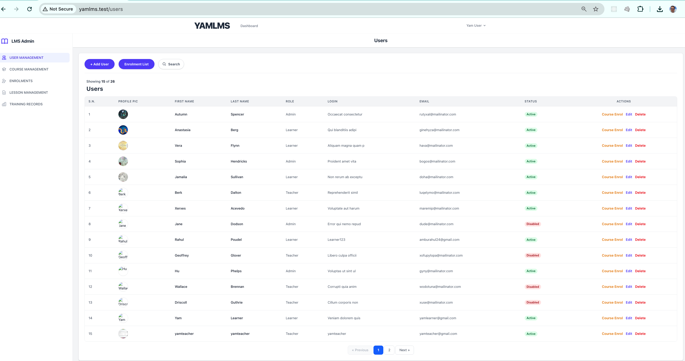
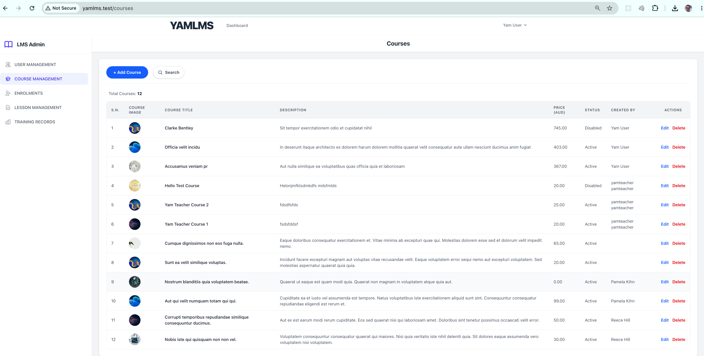
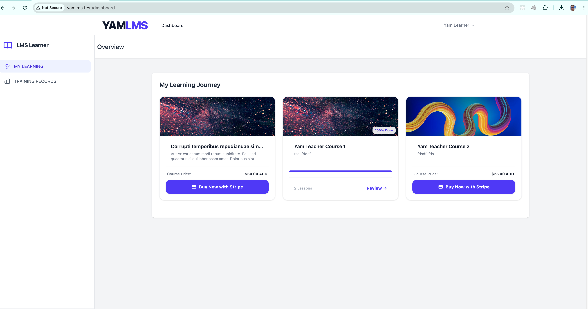
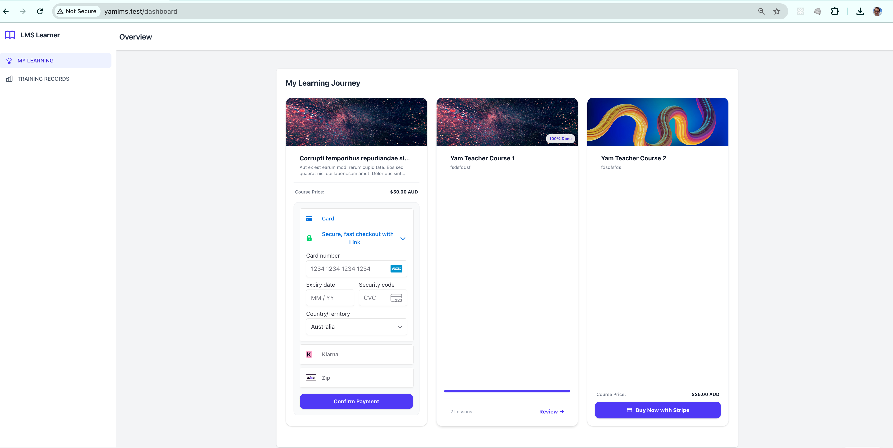
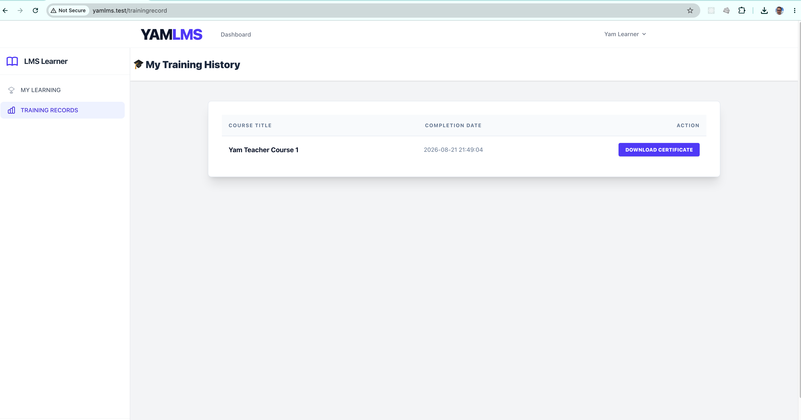

# YamLMS | Yet Another Learning Portal

[](https://laravel.com)
[](https://php.net/releases/8.5/en.php)
[](https://vuejs.org)
[](https://inertiajs.com)
[](https://tailwindcss.com)

**YamLMS** is a Learning Management System for organisations that need to deliver, track, and report on workforce or customer training. It's aimed at high-compliance environments such as **aged care, NDIS providers, and educational institutions**, while remaining suitable for any business that provides training. Built on **Laravel 12**, it covers learner progress tracking, certification, admin management, and online course sales.

> **Frontend migration in progress:** The app is being migrated from Blade to **Vue 3 + Inertia.js**. The **Admin modules — Courses, Lessons, Enrolments, and Users** — are already running on Vue/Inertia. The **learner-facing experience** (dashboard, course player, training record) and **authentication** currently remain on Blade views while the migration continues.

---

## 🌟 Core Features

### 🎓 Learner Experience
- **Cinema-mode course player** — a high-contrast, distraction-free view for working through lessons.
- **Progress tracking** — learner progress is persisted per course/lesson as they move through content.
- **Certificates on completion** — a PDF certificate (via **DomPDF**) becomes available once a course reaches 100% completion; it's locked until then.

### 💰 E-Commerce
- **Stripe Payment Intents checkout** — a `StripeCheckoutController` creates a Payment Intent server-side; the frontend confirms it with Stripe.js/Elements so card details never touch the app's own backend.
- **Signature-verified webhooks** — a dedicated webhook endpoint confirms payment and provisions course access asynchronously, validating the `Stripe-Signature` header before processing.

### 🛡️ Administration & Compliance
- **Admin dashboards** for course, lesson, enrolment, and user management (Vue/Inertia).
- **Role-based access control** — `Course`, `Lesson`, `Enrolment`, and `User` policies restrict actions by role (admin / teacher / learner), backed by feature tests for route-level access.
- **Training records** — a per-learner training/completion record for internal review.

### 📱 API
- **Sanctum-backed API** — session auth for the web app, token auth for external/mobile clients.
- **Endpoints** for auth, course listing/detail, "my courses", and progress, under `/api`.
- **Stripe integrations** live under a dedicated `/api/integrations/stripe/...` namespace (checkout intent + webhook).

---

## 🛠️ Technical Architecture

Business logic is pulled out into dedicated service classes (`CourseService`, `LessonService`, `EnrolmentService`, `ProgressService`, `UserService`, `EmailService`), keeping controllers focused on HTTP concerns.

| Component | Technology |
| :--- | :--- |
| **Backend** | Laravel 12, PHP 8.5 |
| **Authentication** | Laravel Breeze & Sanctum (session auth for web, token auth for API) |
| **Frontend** | Vue 3 + Inertia.js (Admin modules), Blade (remaining pages), Tailwind CSS v4 |
| **Payments** | Stripe API (Payment Intents) |
| **PDF generation** | barryvdh/laravel-dompdf |
| **Database** | MySQL (production) / SQLite (testing) |
| **Build tooling** | Vite |
| **Testing** | Pest 3.x / PHPUnit |

---

## 🧪 Quality Assurance & Security

- **Unit tests** cover core business logic such as `ProgressService`.
- **Feature tests** cover authentication, profile management, course/enrolment authorization, lesson completion, and the course API — including checks that routes are gated correctly by role.
- **Webhook security** — Stripe webhook payloads are rejected unless they carry a valid `Stripe-Signature`.

Run the full test suite with:
```bash
php artisan test
```

---

## ⚙️ Quick Start

1. **Clone and install dependencies**
   ```bash
   git clone https://github.com/yampoudel/YAMLMS.git
   cd YAMLMS
   composer install
   npm install && npm run build
   ```

2. **Environment configuration**
   ```bash
   cp .env.example .env
   php artisan key:generate
   ```
   Configure your database and Stripe test credentials in `.env`:
   ```env
   STRIPE_KEY=pk_test_your_publishable_key
   STRIPE_SECRET=sk_test_your_secret_key
   STRIPE_WEBHOOK_SECRET=whsec_your_local_tunnel_secret
   ```

3. **Create the database**
   ```bash
   php artisan migrate --seed
   ```

4. **Run the application**
   Start the local dev server and asset watcher in separate terminals:
   ```bash
   php artisan serve
   npm run dev
   ```

5. **Local webhook forwarding (development only)**
   To test e-commerce transactions locally, forward Stripe events to the app:
   ```bash
   stripe listen --forward-to yamlms.test/api/integrations/stripe/webhook
   ```

## Useful Commands

```bash
php artisan test       # Run the test suite
php artisan migrate    # Apply database migrations
npm run dev             # Vite dev server with hot reload
npm run build            # Build production assets
```

## 📸 Screenshots

<p align="center">
   <strong>Admin — User Dashboard</strong><br>
   
</p>

<p align="center">
   <strong>Admin — Course Dashboard</strong><br>
   
</p>

<p align="center">
   <strong>Learner Portal</strong><br>
   
</p>

<p align="center">
   <strong>Stripe Checkout</strong><br>
   
</p>

<p align="center">
   <strong>Learner Training Record</strong><br>
   
</p>

---

**Built with ❤️ by Yam Poudel**
